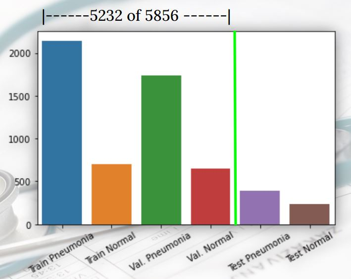
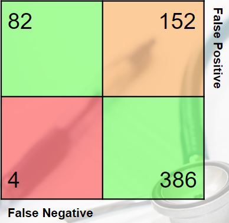
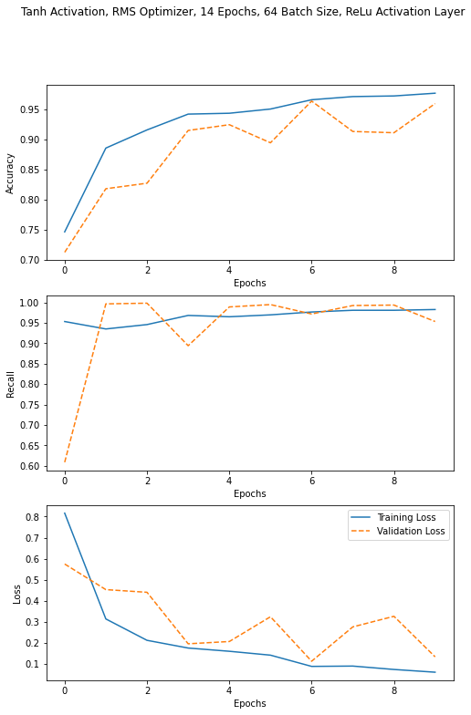

# flatiron_phase4_project


Classifying images of lung X-rays using a Convolutional Neural Network.


Presented by: Rachel Edwards, Svitlana Glibova, Jamie Dowat

## Overview
The purpose of this project is to use an iterative machine learning process to identify pnuemonia in pediatric x-rays. This process involves building convolutional nueral nets and is broken down into a a binary classification process of pnuemonia or not pnuemonia. We hope that with the results of this project we will be better able to serve the over worked medical community during the Covid-19 as well as the children we hope to give a more confident diagnosis too.


## Business Problem
Pnuemonia is one of the leading causes of death in children under five. It is estimated that there are 120 million cases of pnuemonia annually worldwide which results in almost 1.3 million deaths. Pnuemonia has become a growing concern in 2020 as it is a symptom caused by a severe case of covid-19. Children make up 11% of covid cases in the US. It is our goal to develop a tool that is better able to detect pediatric viral pnuemonia. We aim to speicfially target a model that produces the least amount of false negatives and to focus on the recall.

## Data
Our data consists of chest x-ray photos of pediatric patients of one to fives years old from Guangzhou Women and Children's Medical Center, Guangzhou. The data is split into 2 main folders, test and train and then further split into NORMAL or PNUEMONIA. This data in its unprocessed form can be found here: [kaggle data](https://www.kaggle.com/paultimothymooney/chest-xray-pneumonia)


This is a visual breakdown of our data where the green line indicates the split of the distribution of training and test data.

## Methods
Our methods involve creating a binary classification convolutional nueral networks. We go through an iterative model process where the model is tweaked after each cycle to perform better than the last. Our target is reducing false negatives and we evaluate that success based on our recall, loss and accuracy metrics. 

##Modeling  
The final model iteration was a Convolutional Neural Net with the following architecture:  
~~~
	    Conv2D(32, (3, 3), activation='tanh',input_shape=(224 , 224, 1)), //convolutional input layer with hyperbolic tangent activation function
            MaxPooling2D((2, 2)), //pooling layer
            Conv2D(32, (4, 4), activation='relu'), //convolutional layer with a 4x4 matrix transformer
            MaxPooling2D((2, 2), padding = 'same'), //pooling layer with padding
            LeakyReLU(), //leaky ReLu activation layer
            MaxPooling2D((2, 2), padding = 'same'), //pooling layer with padding
            Dropout(.3), //30% dropout layer 
            Flatten(), //flattening layer
	    Dense(128, activation = 'relu') //Densely-connected layer with 128 neurons and ReLu activation
            Dense(64, activation='relu'), //Densely-connected layer with 64 neurons and ReLu activation
            Dense(1, activation='sigmoid')] //output layer with sigmoid activation  
~~~
  
## Results


98% recall - accurately predicted pneumonia in 386 out of 390 cases

High rate of predicting pneumonia in patients with normal lungs

F1 score - 83%

Has only four false negatives




## Conclusions
Final Model  
The final model performed well at maximizing recall but skewed heavily towards false positive predictions.  
It successfully achieved our goals of a low false negative count, but there is still a potential cost of misdiagnosing healthy patients, both to the healthcare provider as well as to the patient and their family in the form of time and emotional labor.  
We would like to continue iterating on the model to reduce the number of positive class predictions.  
 

### Next Steps
 1. We would like to boost the signal of the negative class - augment the ‘normal’ X-Ray image data
 2. We would also like to implement transfer learning, where would find a pretrained model to to transfer its knowledge to ours
 3. We would like to implement a ternary classification model that would distinguish between, normal, viral or bacterial pneumonia

## Repository Structure
```
├── img
├── notebooks
├── src
  ├── __init__.py
  ├── build_nn.py
|
├──environment.yml
├── README.md
└── final_notebook.ipynb
